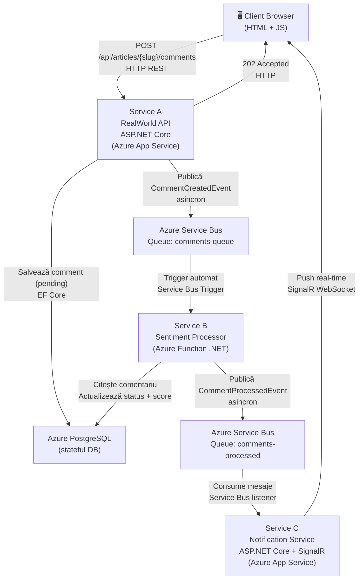

# Arhitectura Sistemului – PCD Project 2026

## Descriere generală

Sistem distribuit de procesare asincronă a comentariilor pentru platforma RealWorld (Conduit).
Utilizatorul postează un comentariu → sistemul îl procesează asincron (analiză sentiment) → notifică
utilizatorul în timp real cu rezultatul.

---

## Diagrama arhitecturală



---

## Fluxul complet (pas cu pas)

```
1. User scrie comentariu și apasă Submit
2. Browser → POST /api/articles/{slug}/comments (Service A)
3. Service A salvează comentariul în PostgreSQL cu status = "pending"
4. Service A publică CommentCreatedEvent în Azure Service Bus (comments-queue)
5. Service A returnează 202 Accepted imediat (nu așteaptă procesarea)
6. Browser afișează comentariul cu status "⏳ pending"
7. Azure Function (Service B) este declanșat automat de mesajul din queue
8. Service B calculează scorul de sentiment al textului
9. Service B actualizează comentariul în PostgreSQL: status = "processed", sentimentScore = X
10. Service B publică CommentProcessedEvent în comments-processed queue
11. Notification Service (Service C) primește evenimentul
12. Service C trimite push SignalR către clientul conectat
13. Browser actualizează UI: status "✅ processed", scor sentiment afișat
```

---

## Componentele sistemului

### Service A – RealWorld API
- **Stack:** ASP.NET Core 10, EF Core, PostgreSQL
- **Hosting:** Azure App Service
- **Rol:** API principal (CRUD articole, comentarii, users)
- **Extensie PCD:** La POST comentariu → publică în Service Bus, returnează 202

### Service B – Sentiment Processor
- **Stack:** Azure Functions (.NET 10)
- **Trigger:** Azure Service Bus (comments-queue)
- **Rol:** Procesare asincronă, calcul sentiment, update DB
- **Idempotență:** Verifică dacă comentariul are deja status != "pending" înainte de procesare

### Service C – Notification Service
- **Stack:** ASP.NET Core 10, SignalR
- **Hosting:** Azure App Service
- **Rol:** Menține conexiuni WebSocket cu clienții, trimite notificări real-time

### Frontend
- **Stack:** HTML5, Vanilla JavaScript, SignalR JS Client
- **Hosting:** Static (poate fi Azure Static Web Apps sau simplu în Service A)
- **Rol:** UI pentru postare comentarii și vizualizare status live

---

## Servicii cloud utilizate

| Serviciu | Tip | Rol |
|---|---|---|
| Azure App Service | PaaS | Hosting Service A + Service C |
| Azure Functions | FaaS | Service B – procesare asincronă |
| Azure Service Bus | Messaging | Comunicare asincronă între servicii |
| Azure Database for PostgreSQL | Stateful DB | Persistență date |

---

## Tipuri de comunicare

| Interacțiune | Tip | Justificare |
|---|---|---|
| Client → Service A | Sincron (REST HTTP) | Utilizatorul așteaptă confirmarea că datele au fost primite |
| Service A → Service Bus | Asincron (fire-and-forget) | Nu blocăm API-ul; procesarea poate dura |
| Service Bus → Service B | Asincron (event-driven) | Decuplare completă; retry automat la eșec |
| Service B → Service Bus | Asincron (fire-and-forget) | Idem |
| Service C → Client | Real-time (WebSocket/SignalR) | Push instant, fără polling |

---

## Modele de consistență

- **Consistență eventuală (Eventual Consistency)**
- Imediat după POST, comentariul apare cu status `pending` (date parțiale)
- După ~1-3 secunde, statusul se actualizează la `processed` prin SignalR
- **Fereastră de consistență:** ~1-3 secunde (latența procesării end-to-end)
- **CAP Trade-off:** Disponibilitate + Partiție toleranță (AP) în detrimentul Consistenței stricte

---

## Reziliență

| Scenariu | Comportament |
|---|---|
| Service B cade | Mesajele rămân în Service Bus queue; retry automat după restart |
| Service C cade | Clienții nu primesc notificări live; pot polling manual GET status |
| Service Bus indisponibil | Service A returnează eroare, comentariul NU e salvat (transacție atomică) |
| PostgreSQL indisponibil | Toate serviciile eșuează graceful cu erori 503 |
